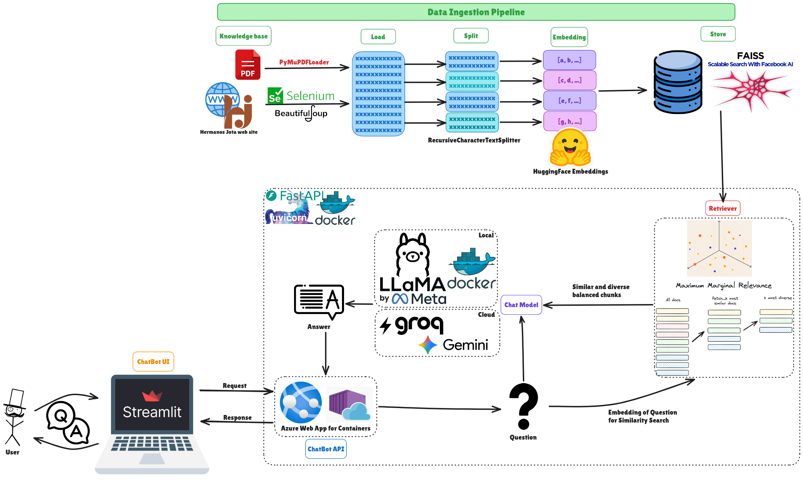
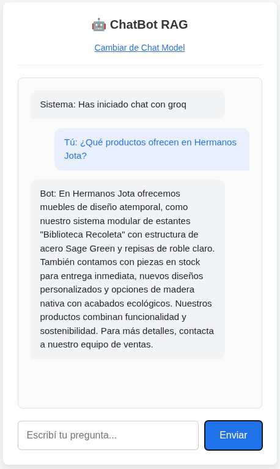
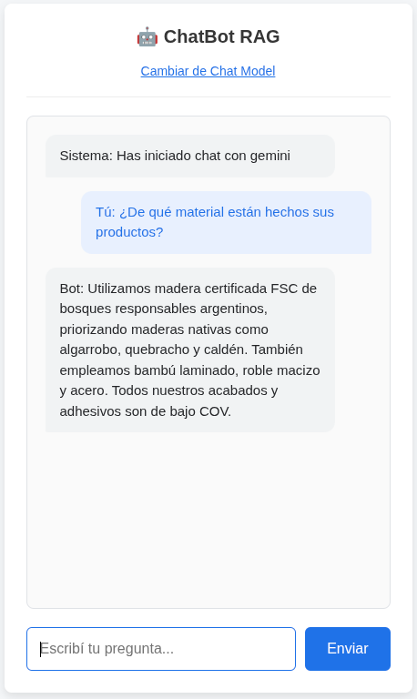
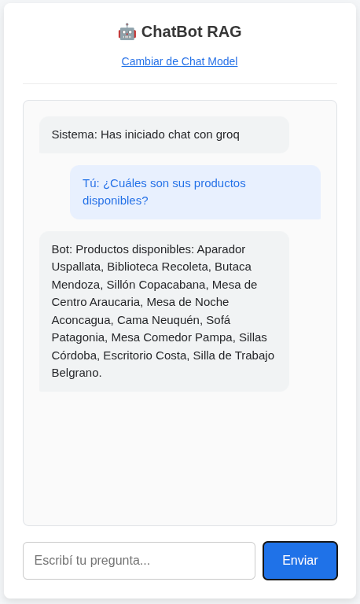
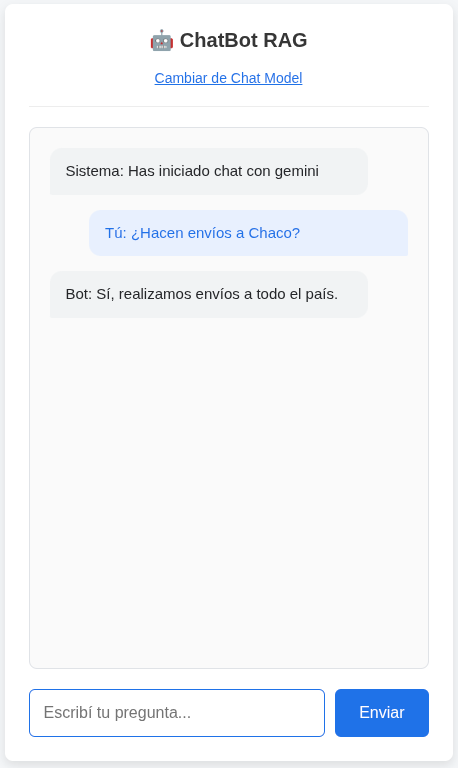
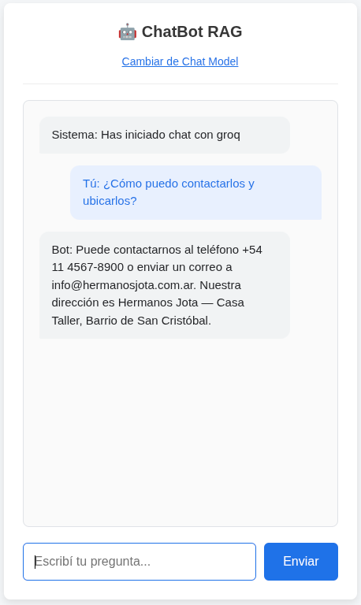

# ChatBot RAG

[](https://github.com/marianoInsa/ChatBot-RAG/actions/workflows/main.yml)


## Description

The chatbot leverages **LangChain**, **FastAPI**, and a Multi-LLM architecture (**Ollama**, **Groq**, **Gemini**) to answer questions based on web documents and PDF files using RAG (Retrieval-Augmented Generation).

The solution is fully containerized using **Docker**, allowing for seamless hybrid deployment: a lightweight version for **Azure App Service** and a full version with local LLMs (LLaMa 2) for local development, with a **Streamlit** interface hosted on **Streamlit Community Cloud**. The architecture focuses on modularity, efficient information retrieval using **FAISS**, and "Lazy Loading" strategies for resource optimization.

- **UI (Streamlit):** [chatbot-rag-ui.streamlit.app](https://chatbot-rag-ui.streamlit.app/)
- **API (Azure):** [chatbot-hermanosjota.azurewebsites.net](https://chatbot-hermanosjota.azurewebsites.net)

## Technologies Used

- **LangChain**: Framework for integrating Large Language Models (LLMs) and building RAG chains.
- **FastAPI**: High-performance framework for exposing the chatbot's REST API.
- **Pytest**: Framework for testing the application.
- **Streamlit**: Python-native UI framework used for the frontend, hosted on Streamlit Community Cloud.
- **Ollama**: Local server for hosting the LLaMa 2 model (offline privacy-focused capability).
- **Groq & Gemini**: Cloud-based LLM providers for high-speed inference in deployed environments.
- **FAISS**: VectorStore for efficient similarity search and information retrieval.
- **HuggingFace**: Used for generating embeddings locally.
- **Docker**: Containerization of services (API + Ollama) for seamless deployment.
- **GitHub Actions**: CI/CD automation for building and pushing images to Docker Hub and Azure.
- **Azure App Service**: Cloud platform used for the API backend deployment (Web App for Containers).
- **Streamlit Community Cloud**: Free hosting platform for the Streamlit frontend.

## Key Features

- **RAG Architecture**: Uses RAG to provide accurate answers based strictly on the provided corpus.
- **Multi-Model Support**: Users can switch between Ollama (Local), Groq, and Gemini.
- **Seamless Deployment**: Optimized for both resource-constrained cloud environments and powerful local machines.
- **Data Ingestion Pipeline**: Automatically loads and indexes data from PDF documents and Web URLs.
- **Interactive UI**: Streamlit-based interface with sidebar configuration and a full chat experience.
- **Design Patterns**: Implements the **Factory Pattern** for scalable model integration (dynamic selection of LLMs and Embeddings) and the **Service Layer Pattern** to strictly decouple business logic from the API endpoints.
- **CI/CD Pipeline**: Automated testing, building and deploying the application using GitHub Actions.

## Component Diagram



## Folder Structure

The project follows a clean, modular architecture designed for maintainability and scalability:

```text
├── .github
│   └── workflows
│       └── main.yml         # GitHub Actions workflow for testing, building and deploying the application
├── app
│   ├── chat_models          # Factory implementations for LLMs (Groq, Gemini, Ollama)
│   ├── embedding_models     # Factory implementations for Embeddings (HuggingFace, Gemini)
│   ├── config               # Configuration settings and environment variable management
│   ├── loaders              # Strategies for data ingestion (PDF, Web scraping)
│   ├── models               # Pydantic data models for request/response validation
│   ├── services             # Core business logic (RAG orchestration, Vectorization)
│   └── main.py              # FastAPI entry point (API only)
├── tests                    # Unit tests for the application
├── .streamlit
│   └── config.toml          # Streamlit theme configuration (dark/blue)
├── corpus                   # Source documents (PDFs) for the Knowledge Base
├── vector_store             # Persistent storage for FAISS vector indices
├── streamlit_app.py         # Streamlit frontend entry point
├── pytest.ini               # PyTest configuration (test paths, coverage, asyncio)
├── Dockerfile               # Production image definition (FastAPI API)
├── Dockerfile.ollama        # Custom image definition for Ollama pre-loaded with LLaMa2
├── docker-compose.yml       # Orchestration for local development
└── requirements.txt         # Python dependencies (FastAPI + backend)
```

**Detailed Breakdown**

- `app/chat_models` & `app/embedding_models`: Contains the **Factory** logic to instantiate the correct model provider based on user configuration or environment variables.
- `app/services`: Implements the **Service Layer**. `ChatService` handles the RAG flow (Retrieve + Generate), while `DataService` manages document loading and vector store creation.
- `app/loaders`: Contains the logic to parse different data sources, normalizing them into a standard format for the vector store.
- `corpus`: Directory where raw documents (PDFs) are placed to be ingested by the system.
- `vector_store`: Generated at runtime/build time; stores the FAISS indices to avoid re-calculating embeddings on every restart.

---

# Deployment

## API — Azure Web App for Containers

- **Container image**: The Azure Web App is configured to run the image built by GitHub Actions from this repository.
- **Image name**: `${DOCKERHUB_USERNAME}/chatbot-rag`, where `DOCKERHUB_USERNAME` is the Docker Hub username stored as a GitHub secret.
- **Tags**:
  - `latest`: always points to the most recent successful build from the `main` branch.
  - Short commit SHA tag (e.g. `abc1234`): allows you to know exactly which commit is deployed and to roll back quickly.
- **CI/CD flow**:
  - On every push to `main`, GitHub Actions builds the image from the `Dockerfile`, pushes it to Docker Hub with both tags (`latest` and the short SHA), and then updates the Azure Web App to use the new SHA tag.
  - Azure Web App for Containers pulls the new tagged image and restarts the container, ensuring that each deployment uses a fresh image version.

## UI — Streamlit Community Cloud

- **Entry point**: `streamlit_app.py`
- **Live URL**: [https://chatbot-rag-ui.streamlit.app/](https://chatbot-rag-ui.streamlit.app/)
- **Deploy**: Connected directly to this GitHub repository. Deploys automatically on every push to `main`. No changes to the GitHub Actions workflow required.
- **Environment variable**: `API_URL = "https://chatbot-hermanosjota.azurewebsites.net"` configured in Streamlit Cloud secrets.

---

# Deployment with Docker on Local Machines

## Prerequisites

- Ensure **Docker** and **Docker Compose** are installed on your machine.
- Verify you have sufficient memory (at least 8GB RAM recommended) if running the local **Ollama** instance.

## Steps to Deploy

- **Clone the Repository**: Clone the project repository to your local machine:

```sh
  git clone [https://github.com/marianoInsa/ChatBot-RAG.git](https://github.com/marianoInsa/ChatBot-RAG.git)
  cd ChatBot-RAG
```

- **Start the Services**: Run the following command to start the containers using the provided `docker-compose.yml` file. This will pull the pre-loaded Ollama image and build the backend:

```sh
docker compose up
```

- **Access the Chatbot**: Once the containers are running, open the Streamlit UI at [http://localhost:8501](http://localhost:8501). You can also access the API docs at [http://localhost:8000/docs](http://localhost:8000/docs).

## Test and Verify

Open a browser and navigate to the Streamlit UI at [http://localhost:8501](http://localhost:8501). Select a model, enter your API Key if needed, and start chatting. You can also access the FastAPI docs at [http://localhost:8000/docs](http://localhost:8000/docs).

Ask sample questions related to the loaded corpus (e.g., "Hermanos Jota" furniture), such as:

1. _¿Qué productos ofrecen en Hermanos Jota? (What products do you offer at Hermanos Jota?)_



2. _¿De qué material están hechos sus productos? (What material are your products made of?)_



3. _¿Cuáles son sus productos disponibles? (What products are available?)_



4. _¿Hacen envíos a Chaco? (Do you ship to Chaco?)_ _(a province in Argentina)_



5. _¿Cómo puedo contactarlos y ubicarlos? (How can I contact you and find you?)_



**Shut Down the Services**: When you're done testing, stop and remove the containers using:

```sh
docker compose down
```

---

# Testing

## Strategy

The project uses **PyTest** with **pytest-cov** for unit testing and code coverage. All tests are located in the `tests/` directory, mirroring the structure of `app/`:

```text
tests/
├── chat_models/          # Tests for LLM factories (Gemini, Groq, Factory)
├── embedding_models/     # Tests for Embedding factory
├── loaders/              # Tests for PDF, Web, Normalizer, and Loader
├── services/             # Tests for DataIngestionService and ChatService
├── test_main.py          # Tests for FastAPI endpoints and rag_chain
└── conftest.py           # Shared fixtures (mock settings, embeddings, etc.)
```

All tests use **mocks** to isolate dependencies (API keys, Selenium, FAISS, LLM providers), so they run fast and don't require any external services or credentials.

## CI/CD Integration

Tests are automatically executed in the **GitHub Actions** pipeline as the first step before building and deploying. If any test fails, the pipeline stops and the deployment is blocked:

```text
test → build-and-push → deploy
```

## Running Tests Manually

```sh
# Run all tests with verbose output
pytest -v

# Run with coverage report in terminal
pytest --cov=app --cov-report=term-missing -v

# Generate HTML coverage report (saved to htmlcov/)
pytest --cov=app --cov-report=html
```

---

© 2026 | Made with blood, sweat, and tears by [Mariano Insaurralde](https://www.linkedin.com/in/marianoinsa).
